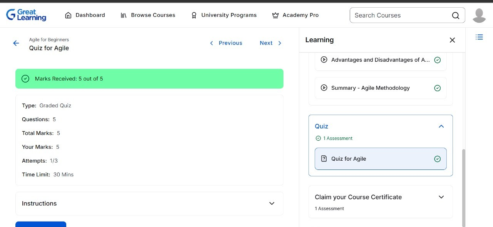
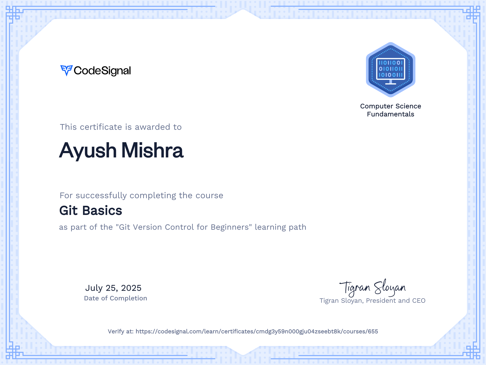

# 💼 LTTS STEPIn Training

Welcome to the documentation of my progress in the **LTTS STEPIn Pre-joining Training Program**.  

This repository contains modules, assignments, and proof of completion.

---

## 📘 Week 1 – Module 1: *Applied SDLC, Agile & Testing Methodology*

- Covered topics like SDLC models, Agile methodology, and testing principles.

- Successfully completed the Agile quiz with full marks ✅

### 🖼️ Agile Quiz Completion Screenshot:

---

## 💻 Week 2 – Module 2: *Collaboration and Source Code Management with Git*

- Learned Git fundamentals, branching, merging, and working with GitHub.

- Practiced hands-on commands for local and remote repository management.

### 🖼️ SimpliLearn Git Training Certificate Screenshot:

[SimpliLearn certificate](git_training/simpliLearn.png)

### 🖼️ CodeSignal Git Training Certificate Screenshot:

