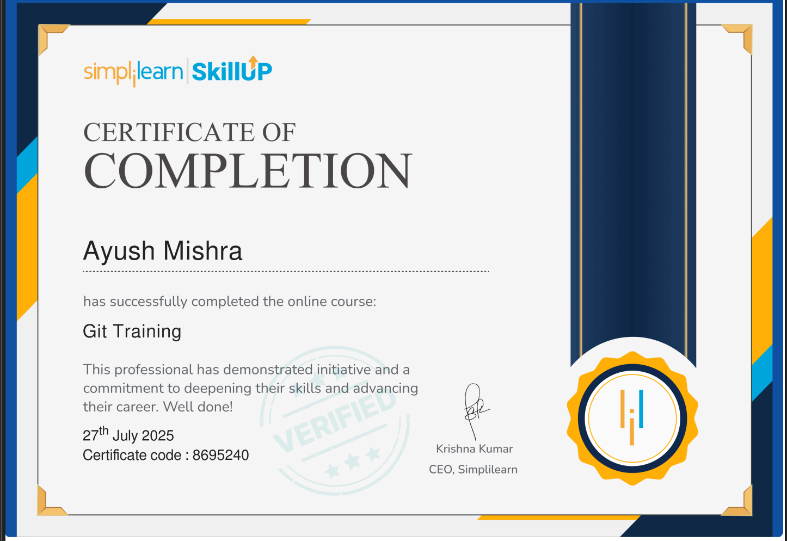

# 💼 LTTS STEPIn Training

Welcome to the documentation of my progress in the **LTTS STEPIn Pre-joining Training Program**.  

This repository contains modules, assignments, and proof of completion.

---

## 📘 Week 1 – Module 1: *Applied SDLC, Agile & Testing Methodology*

- Understood the Software Development Life Cycle (SDLC) phases — requirement gathering, design, development, testing, deployment, and maintenance

- Gained knowledge of Scrum framework — roles (Scrum Master, Product Owner, Development Team), ceremonies (Sprint Planning, Daily Stand-ups, Sprint Review, Retrospective).

- Gained insight into continuous feedback loops in Agile for faster product improvement.

### 🖼️ Agile Quiz Completion Screenshot:

---

## 💻 Week 2 – Module 2: *Collaboration and Source Code Management with Git*

- Understood the importance of version control systems in collaborative software development.

- Learned to initialize and manage Git repositories (local and remote).

- Practiced staging, committing, and pushing code changes to GitHub.

- Used Git commands such as git init, git clone, git add, git commit, git push, git pull, and git merge.

- Understood best practices for commit messages and maintaining a clean repository history.

### 🖼️ SimpliLearn Git Training Certificate:

### 🖼️ CodeSignal Git Training Certificate:

## 🐧 Week 3 – Module 3: *Linux Fundamentals and Commands Practice*

- Understood the Linux operating system structure, including kernel, shell, and file system hierarchy.

- Navigated the Linux environment using basic file and directory commands (ls, cd, pwd, mkdir, rmdir).

- Learned file manipulation commands (cp, mv, rm, touch, cat, nano, vi).

- Practiced file permissions and ownership management using chmod, chown, and chgrp.

- Explored system information commands (uname, df, du, top, ps).

- Used input/output redirection (>, >>, |, <) and piping to chain commands.

### 🖼️ Linux Command History Screenshots:

### 🖼️ SoloLearn Certificates:

